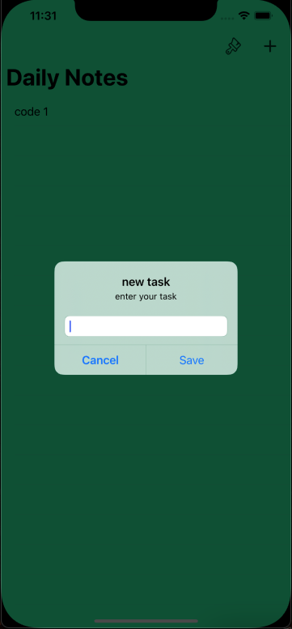
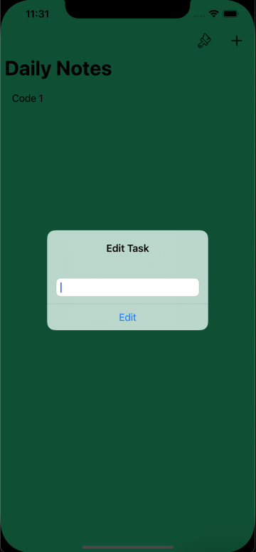
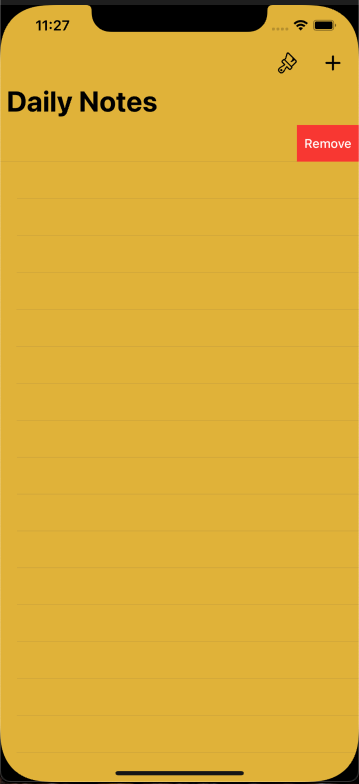

# DailyTasks
- Notes App Built on Core Data & UserDefaults with MVC Pattern.
- Project completely written in Swift. 
## CRUD implementation.
- Create
<p align="center">

</p>

- Edit ,  Click On Cell
<p align="center">

</p>

- Remove , Swipe Action
<p align="center">

</p>


## UserDefaults was extended by NSKeyedArchiver to convert  UIcolor to Data for Storing Color  for  TableView colors. 

```swift
extension UserDefaults{
    //color set
    func putColor(_ val:UIColor?,forKey key:String) {
        var putColorData:Data?
        if let myData = val {
            putColorData = try! NSKeyedArchiver.archivedData(withRootObject: myData, requiringSecureCoding: false)
        }
        set(putColorData, forKey: key)
    }
    
    //color load
    func getColor(forKey key:String) -> UIColor? {
        var getColorData:UIColor?
        if let myColor = data(forKey: key){
            getColorData = try! NSKeyedUnarchiver.unarchiveTopLevelObjectWithData(myColor) as? UIColor
        }
        return getColorData
    }
}
```

## UIAlertController was extended for changing its color According to TableView Color. 

```swift
//Alert Background Control
extension UIAlertController{
    func printBackgroundColor(_ color:UIColor?){
        let viewScene = self.view.subviews.first?.subviews.first!.subviews.first
        if  (viewScene != nil){
            viewScene?.backgroundColor = color
        }
    }
}

//alternative code
//colorAlert.view.subviews.first?.subviews.first?.subviews.first?.backgroundColor = self.table.backgroundColor

```
## in app there is a more than 15 Different Color to Select

photo
